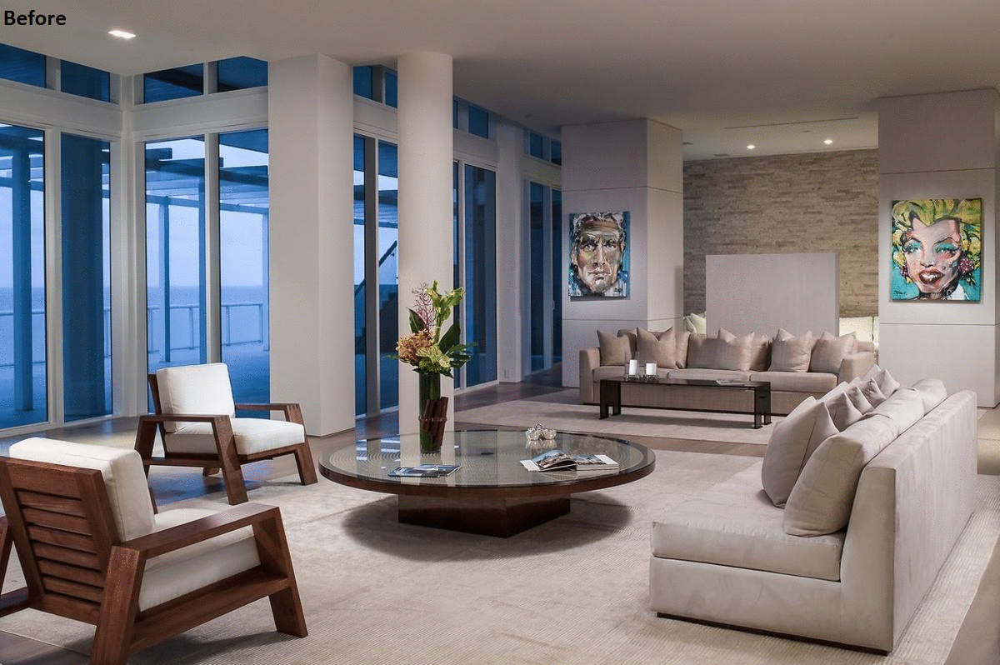
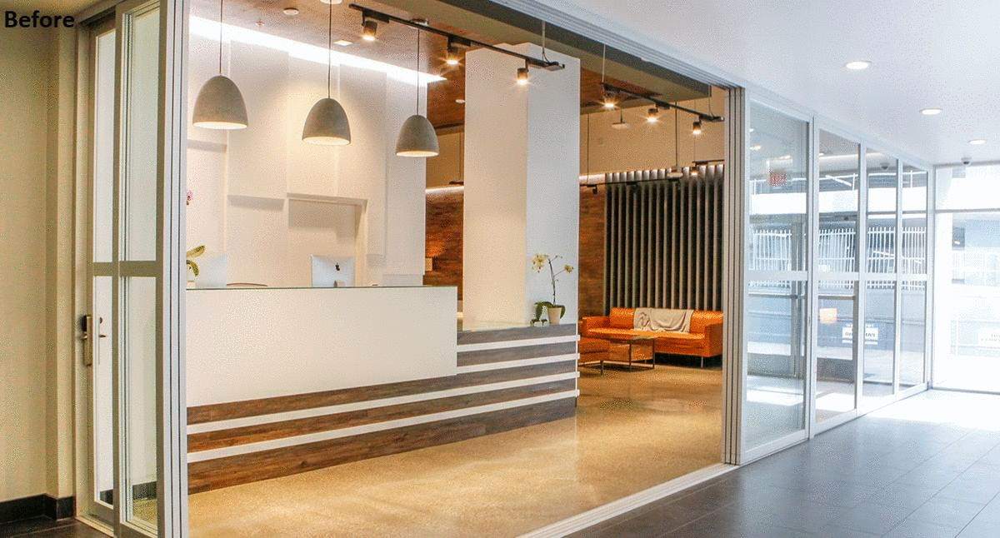
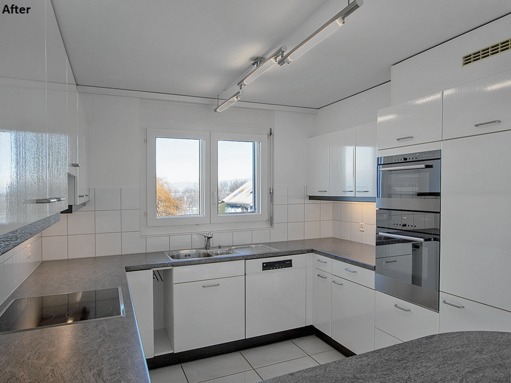

# Remove Color Cast
Program to remove color casts from interior photos.
This program is meant as a tool for the photo editing process and is NOT designed to create finished photos.
This program supports .tif/.tiff files as they are a common file type when photo editing. In addition, the progam also supports .png and .jpg 

## Limitations
This program does not meet the requirements for a baseline tiff reader/writer as defined by the TIFF 6.0 specifications
The type of tiffs this program supports is small. This program is also currently implemented to only run on windows. 

To be processed by the program, the tiff must meet this requirements:
* Uncompressed (no internal compression)
* Contain only 1 image
* 3 channels per pixel (rgb)
* sRGB color space
* 8 or 16 bits per-channel

## What does the program do?
The program analyzes each pixel. The program moves the color of each pixel closer to true gray (rgb values all the same) depending on how grayness of the original pixel. This means that colors close to gray become true gray, and color that are not gray (red, orange, yellow, etc) remain relatively unchanged. 

The program will prompt the user to select and input folder of tiffs they want to convert as well as an output folder where they want the results to be saved.

The user can dictate how much they want the program to move colors to true gray. They can enter floating point values in the range [0.1, 15]. Entering a value of 0.1 will make the entire image entirely grayscale, while 15 will barley have a perceptible change. Currently the scale is not linear, changing from 1 to 2 will have a much greater effect than changing from 14 to 15. 

## GPU 
This program uses the gpu to handle all of the image processing. This greatly decreases the time it takes to convert large image files (especially 16 bit tiffs). To achieve gpgpu computing, this program uses the CUDA toolkit for Nvidia graphics cards. The card must have a compute capability of 3.0 or above to work with this program. If you do not have a Nvidia graphics card or one that meets the compute specifications. There is a separate branch of this repo called cpu where all of the image processing is completed on the cpu.

There is a precompiled executable in the execuatbles folder. It is necessary to have the cudart64_110.dll in the same directory as the executeable, or you can install the Nvidia Developer CUDA toolkit. If you run the executable and see a "driver version is insufficient for CUDA runtime version", you need to update your graphics drives. If you update your drivers through device manager and still see this error, you might need to use Nvidia's GeForce Experience app to update your drivers. 

## Examples

In this first example, notice how the walls and ceiling on the right side of the photo lose their red tint.

In this second example, notice how the desk and the wall behind it lose their yellow tint.

In this third example, notice how the cabinets on the right lose their blue tint. 

